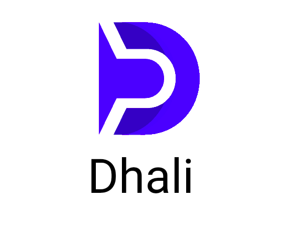

  

* [Dhali](https://dhali.io/#/) is a Web 3.0 open marketplace for creators and consumers of AI. To interact with the marketplace users simply stream blockchain enabled micropayments for what they need, when they need it. No logins or subscriptions are required.
* [Dhali-examples](https://github.com/Dhali-org/Dhali-examples) provides a collection of example assets that can be uploaded to Dhali. In some cases, it also provides example applications for consuming the services of the assets.

# Examples

## image_net_classifier

* This asset provides basic image-net classification (computer vision) functionality on-demand.
* [Deployment instructions](./examples/image_net_classifier/asset). Once deployed, this asset should be visible in the Dhali marketplace.
* [Usage instructions](./examples/image_net_classifier/consumer_application).
